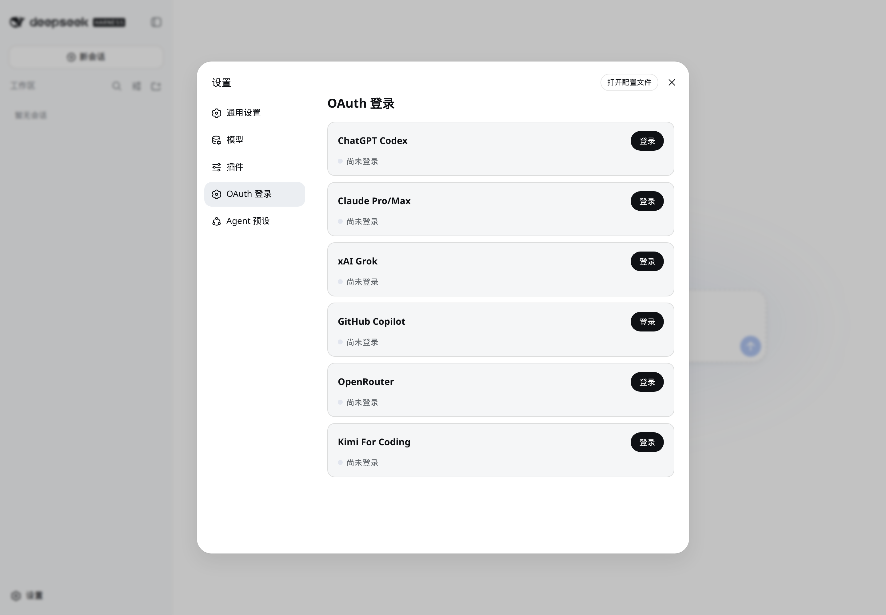
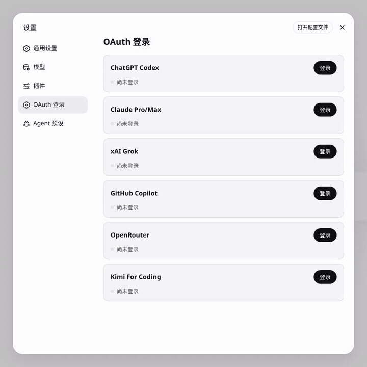
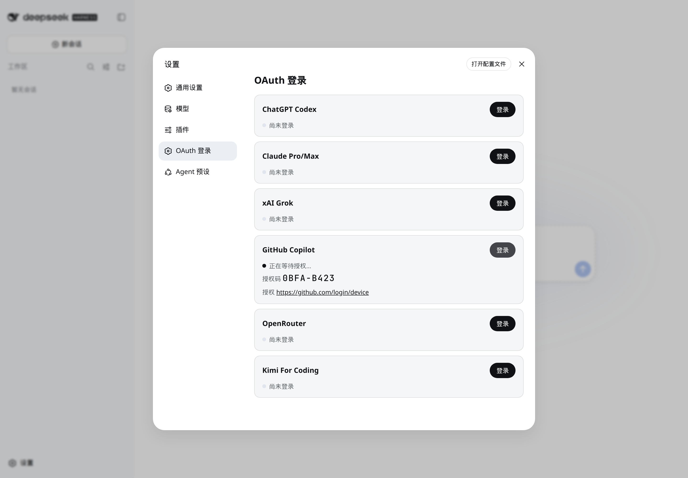
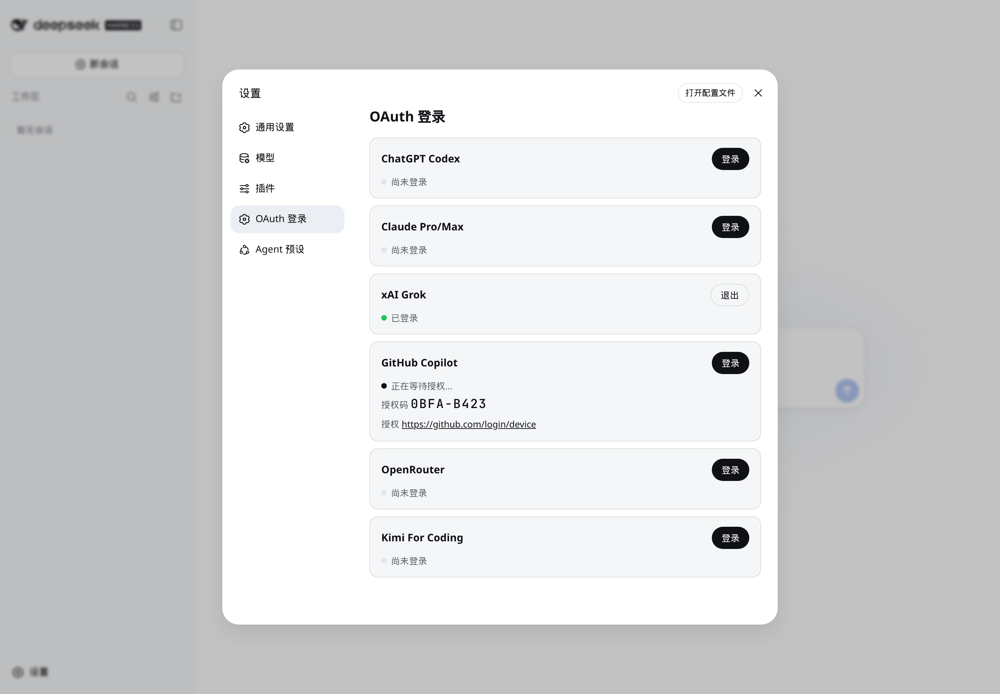
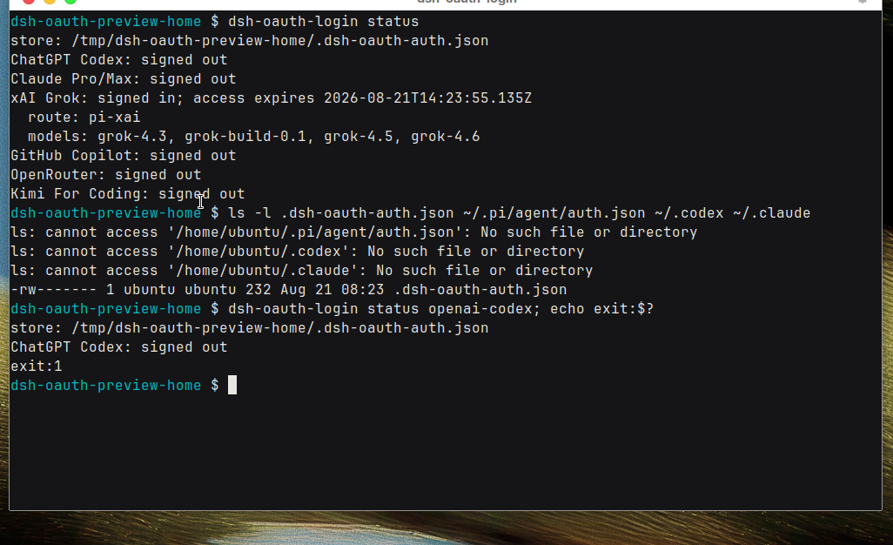

# dsh-oauth-login

[中文](README.md) | English

Sign ChatGPT, Claude, Grok, Copilot, OpenRouter, and Kimi into [DeepSeek Harness](https://github.com/deepseek-ai/deepseek-harness). The adapters are the same ones Pi Agent uses for `/login`. The grant is written only to DSH's own `$DSH_HOME/.dsh-oauth-auth.json`.

Use this if you already pay for a provider subscription and do not want to paste an API key into Harness. Official `codex login`, Claude Code, the `grok` CLI, and Pi Agent's `~/.pi/agent/auth.json` are never read or written.

## What it looks like

These shots are from this repo installed into `dsh web`, then **Settings → OAuth Login**. Not mockups.

Harness was in Chinese on the machine that took them. The plugin copy follows the Harness language setting.



Click **Sign in** on GitHub Copilot. The plugin asks GitHub for a device code. The card switches to "waiting for authorization" and shows `github.com/login/device`. Official CLI auth files are not created.





The green Grok row is a dummy grant written to `$DSH_HOME/.dsh-oauth-auth.json` so the signed-in / Sign out state could be photographed. It is not a live xAI session. The file contents are not in any screenshot.



The CLI reads the DSH store, not official CLI auth files. `status` does not print tokens. Codex unsigned exits 1. The `ls` is there to show `~/.pi`, `~/.codex`, and `~/.claude` were left alone.



## Install

Node 22.19+ and a working DeepSeek Harness.

```sh
npx @deepseek-ai/dsh web
```

In another terminal, add this plugin next to Harness. Keep the `file:` prefix.

```sh
git clone https://github.com/aa2246740/dsh-oauth-login.git
dsh plugin --profile web add file:./dsh-oauth-login
```

A bare `./dsh-oauth-login` is installed as a symlink. This plugin treats the Harness runtime as peer dependencies, so the copied `file:` install is what lets Node resolve them from the profile.

Restart `dsh web`. Open **Settings → OAuth Login**. Pick a `pi-…` route in the composer.

```sh
dsh plugin --profile web exec dsh-oauth-login login openai-codex
dsh plugin --profile web exec dsh-oauth-login login xai
dsh plugin --profile web exec dsh-oauth-login status
```

Existing DSH installs migrate the old `.pi-login-auth.json` name on the next write. That file is not Pi Agent's auth file.

## Providers

| Settings card | Harness route | Pi provider |
|---|---|---|
| ChatGPT Codex | `pi-openai-codex` | `openai-codex` |
| Claude Pro/Max | `pi-anthropic` | `anthropic` |
| xAI Grok | `pi-xai` | `xai` |
| GitHub Copilot | `pi-github-copilot` | `github-copilot` |
| OpenRouter | `pi-openrouter` | `openrouter` |
| Kimi For Coding | `pi-kimi-coding` | `kimi-coding` |

Radius is omitted. It needs a custom gateway.

## Where the grant lives

Credentials go only in `$DSH_HOME/.dsh-oauth-auth.json`, owner-only. Do not paste that file, callback URLs, authorization codes, or tokens into a public issue. Private reporting is in [SECURITY.md](SECURITY.md).

## Hosted search and images

Official DSH always registers `web_search` and sends it through `ctx.web` (default: another DeepSeek Messages call with `DEEPSEEK_API_KEY`). That hides the hosted tools your OAuth account already has.

On these routes the plugin removes DSH `web_search` / `web_fetch` from the model-facing schema and attaches the provider tools instead.

| Route | Hosted tools |
|---|---|
| `pi-xai` | `web_search`, `x_search`, `image_generation` |
| `pi-openai-codex` | `web_search`, `image_generation` |
| `pi-anthropic` | `web_search_20250305` |

Copilot, OpenRouter, and Kimi are left alone. They have no single hosted tool this plugin can attach. DeepSeek official chat is unchanged.

Hosted search bills the OAuth subscription / tool quota of that provider. It does not need Exa, Perplexity, or DeepSeek Search. Server-side search traces are not executed as DSH tools. Empty Grok Think cards from hosted search hops are dropped. Reasoning that starts after the visible reply is also dropped. Hosted images are saved through the attachment store and shown in the assistant turn.

Hosted tools are a per-request capability. Context filtering and payload injection run together only when the caller supplies a `tools` list. Auxiliary text-only calls that omit `tools`, including approval reviewers and title generation, stay text-only.

To keep DSH's own search tool:

```yaml
- id: llm-oauth-login
  name: dsh-oauth-login
  config:
    nativeTools: false
```

`nativeImage: false` keeps hosted search but drops image generation.

## When the model fails

This plugin does not invent a private retry loop. Chat uses official `dsh-llm-retry` and official `LlmError` codes. The plugin only appends a short hint and keeps the code.

| Code | What it usually is | What to do |
|---|---|---|
| `RATE_LIMIT` | Request-rate or peak busy. Many HTTP 429s land here. | Wait out the five automatic retries, then send another message. |
| `QUOTA` | Plan, usage window, or balance. | Retry will not refill it. Check the provider plan. |
| `TIMEOUT` / `TRANSPORT` | Idle stream or network. | Send another message after the turn ends. |
| `SERVER` | Provider 5xx / some overloaded responses. | Same as other transient codes. |
| `AUTH` / `MISSING_CREDENTIAL` | Grant missing or rejected. | Settings → OAuth Login. Chat may show AUTH as "API key is invalid". |

A 429 is not automatically "busy", and it is not automatically "out of money". Official classification reads the provider text: quota wording becomes `QUOTA`, other 429s become `RATE_LIMIT`. Five-hour or weekly windows are only `QUOTA` when the provider said so in those words.

On RC8 the default budget is five automatic retries for the transient codes above. After that the turn ends. If Continue fails or the composer stays stuck, start a new chat.

To raise the budget without editing plugin code, patch the `llm-oauth-login` row:

```yaml
- id: llm-oauth-login
  name: dsh-oauth-login
  config:
    retryPolicy:
      mode: normal
      maxRetries: 7
      backoff:
        initialDelayMs: 1000
        maxDelayMs: 30000
        jitterRatio: 0.1
```

`mode: always` retries every failure until success or cancel. That can spend paid quota. Creator Mode / host-model timeouts use whichever provider you selected in the composer, not this plugin.

## Proxy

OAuth and subscribed-provider requests use the first available route in this order: inherited `HTTP_PROXY`, `HTTPS_PROXY`, or `ALL_PROXY`; the plugin-only `DSH_OAUTH_PROXY` override; an enabled and reachable macOS system HTTP/HTTPS proxy; a verified HTTP CONNECT proxy on a common loopback port; then direct access.

Loopback candidates are accepted only after a credential-free CONNECT probe. The plugin does not add country, region, locale, or other geographic metadata. To force a proxy, start DSH with `DSH_OAUTH_PROXY=http://127.0.0.1:45678`. Restart `dsh web` after changing proxy applications or settings.

## License

Apache-2.0. This is a community plugin and is not affiliated with DeepSeek, Pi Agent, or the supported OAuth providers.
